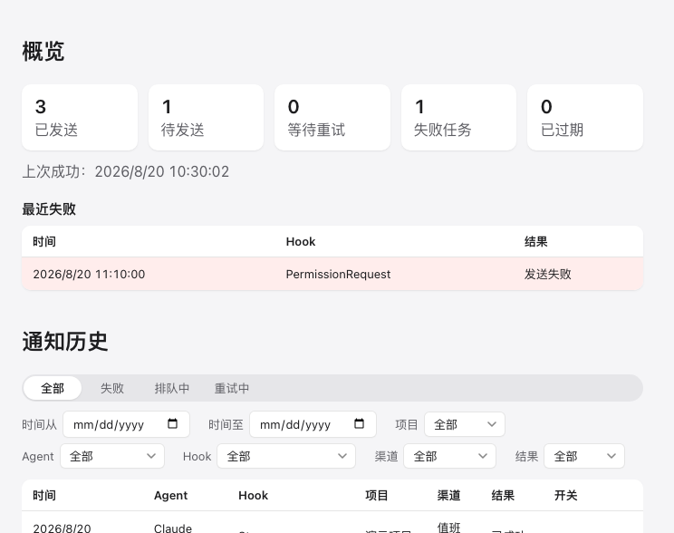
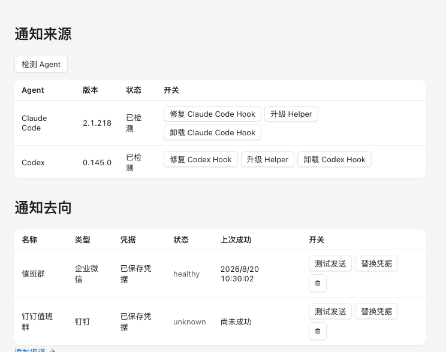
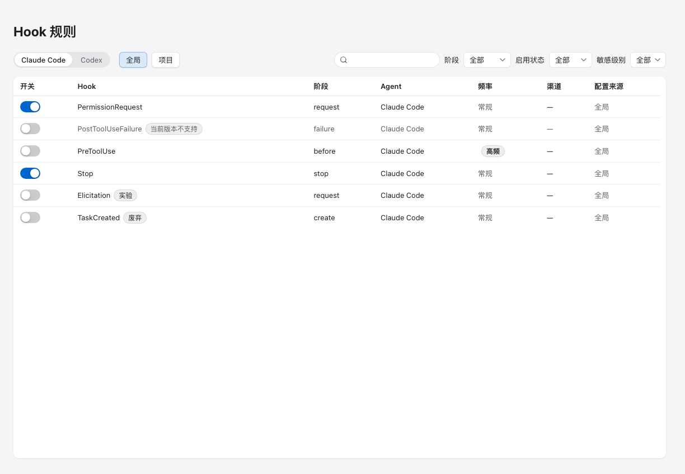

# CC Reminder

CC Reminder 是一个跨平台桌面应用：它通过 Claude Code 和 Codex 的生命周期 Hook 捕获事件，在本地完成规则匹配、隐私过滤与排队，然后把通知发送到你的钉钉群或企业微信群。任务完成、等待确认、需要授权时，你在群里第一时间知道——而审批、停止等操作仍然完全留在 Agent 原有流程中。

<p align="center">
  
  
</p>
<p align="center">
  
</p>

## 基本信息

- **支持的 Agent**：Claude Code（用户级 `~/.claude/settings.json`）、Codex（`~/.codex/hooks.json`，信任确认走官方 `/hooks`）
- **支持的通知渠道**：钉钉自定义机器人、企业微信群机器人（仅官方 HTTPS Webhook 端点）
- **平台**：macOS 12+（Apple Silicon / Intel）、Windows 10/11 x64、Ubuntu 22.04+ x64

## 安装

发布产物通过 GitHub Releases 分发：前往本仓库的 **Releases → Latest** 页面，下载对应平台的安装包（macOS `.dmg`、Windows `.msi`/NSIS 安装器、Linux `.AppImage`/`.deb`），每个文件附带 `.sha256` 校验和。

> 注意：二进制安装包自**第一个正式版本 tag** 构建起才提供；在此之前 Releases 页面尚无产物。

从源码运行：

```bash
pnpm install --frozen-lockfile
pnpm tauri dev
```

首次启动后按引导完成：检测 Agent → 安装 Hooks → 添加渠道 → 选择默认规则 → 发送测试。详细操作、诊断导出与安全卸载说明见[运维手册](docs/operations.md)。

## 隐私

- 事件在本地处理：默认只外发脱敏后的元数据与摘要字段，敏感内容在 Hook 进程内即被丢弃或加密存储于本机数据库。
- 渠道凭据（Webhook、token、签名密钥）只保存在操作系统安全存储中（macOS 钥匙串 / Windows 凭据管理器 / Linux Secret Service），界面不回显。
- 无遥测、无远程日志、无云端依赖；诊断包只含脱敏日志与统计信息。
- 卸载应用内的 Hook 时只移除 CC Reminder 自己创建的条目，你原有的配置逐字节保留。

## 文档

- 运维手册（安装、信任、队列语义、诊断、卸载与发布验收清单）：[docs/operations.md](docs/operations.md)
- 分层架构与依赖方向约定：[docs/architecture.md](docs/architecture.md)
- 待办与实机事件记录：[docs/v2-issues.md](docs/v2-issues.md)
- v1 设计与实施计划：[docs/superpowers/specs/2026-07-29-cc-reminder-design.md](docs/superpowers/specs/2026-07-29-cc-reminder-design.md) / [docs/superpowers/plans/2026-07-29-cc-reminder.md](docs/superpowers/plans/2026-07-29-cc-reminder.md)

## 许可证

暂未随 v1 指定；发布前由维护者补充。
