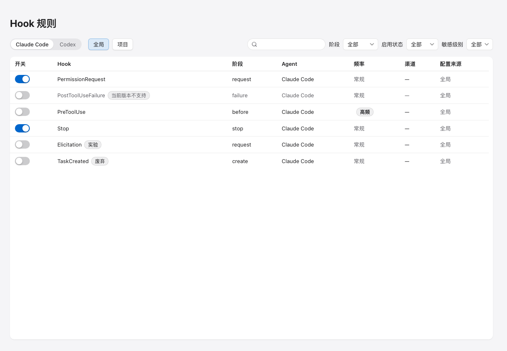

<div align="center">

# CC Reminder

**Claude Code / Codex 的群通知管家 —— 任务完成、等待确认、需要授权时，你的钉钉 / 企业微信群第一时间知道。**

审批、停止等操作仍然完全留在 Agent 原有流程中，CC Reminder 只做一件事：把值得知道的事，可靠地送到你手里。

[](https://github.com/Wang-Shujie/cc-reminder/releases/latest)
[](https://github.com/Wang-Shujie/cc-reminder/actions/workflows/release.yml)


[English](./README_EN.md) · 简体中文




</div>

## ✨ 功能特性

- **🔗 生命周期 Hook 捕获** —— 通过 Claude Code / Codex 的官方 Hook 机制捕获会话与工具事件；已签名的独立 helper 进程负责投递，审批与停止流程零干扰（中性输出、恒定退出码）。
- **🎯 规则引擎** —— 全局规则 + 项目级字段覆盖；静默时段、高频聚合、冷却窗口、TTL 过期；权限请求永不聚合，重要事件绝不排队等待。
- **🛡 隐私优先** —— 敏感字段在落库前完成 XChaCha20-Poly1305 字段级加密，密钥存于系统钥匙串 / 凭据管理器；通知模板可控脱敏；诊断包内强制脱敏。
- **📬 可靠投递** —— 指数退避重试（尊重 `Retry-After`）、至少一次投递、离线 spool 补发；凭据连续失败三振自动暂停渠道，恢复凭据即恢复投递。
- **❤️‍🩹 自愈式健康** —— Agent 配置被外部修改/清空时自动修复；Hook 漂移、渠道暂停、队列堆积统一投影到工作台与托盘菜单。
- **🔔 原生托盘** —— 打开主窗、健康一览、暂停 15 分钟 / 1 小时 / 今日、恢复、退出，中英文跟随应用设置。
- **🔌 开放渠道** —— 钉钉自定义机器人（加签 / 关键词）与企业微信群机器人，仅官方 HTTPS Webhook 端点。
- **🌐 跨平台** —— macOS 12+（Apple Silicon / Intel）、Windows 10/11 x64、Ubuntu 22.04+ x64。

## 📦 安装

前往 [**Releases → Latest**](https://github.com/Wang-Shujie/cc-reminder/releases/latest) 下载对应平台安装包，每个文件附带 `.sha256` 校验和：

| 平台 | 产物 |
|---|---|
| macOS 12+ (Apple Silicon / Intel) | `.dmg` |
| Windows 10/11 x64 | `.msi` / NSIS 安装器 |
| Ubuntu 22.04+ x64 | `.AppImage` / `.deb` |

> 二进制产物自第一个正式版本 tag 起提供；更新基于 Tauri updater，更新清单经 minisign 验签。

## 🚀 快速开始

1. **启动应用** —— 首次启动进入引导向导，按提示完成检测与默认规则。
2. **接入 Agent** —— 集成页 **检测 Agent** → **安装 Hook**；Codex 需在其官方界面运行 `/hooks` 完成一次信任确认。
3. **创建机器人** —— 在钉钉 / 企业微信群里建机器人拿 Webhook（分步指引见应用内表单与[运维手册 §5](docs/operations.md)），在集成页添加渠道并 **测试发送**。
4. **配置规则** —— 在通知规则页按事件 / 项目 / Agent 过滤，选择投递渠道，完成。

## 🔧 工作原理

```
Claude Code / Codex ──hook──▶ 已签名 helper ──IPC──▶ 规则匹配 · 隐私过滤 ──▶ 投递队列 ──▶ 钉钉 / 企业微信
                                    │                    │
                                 离线落盘 spool        本地 SQLite（字段级加密）
```

应用不可用时 helper 自动落盘，恢复后按 TTL 补发；所有审批、停止等交互操作不经 CC Reminder，保持 Agent 原生体验。

## 🛠 从源码构建

```bash
# 前置：Node 20+ / pnpm 10+ / Rust 1.80+（macOS 需 Xcode CLT，Linux 需 webkit2gtk-4.1）
pnpm install --frozen-lockfile

pnpm dev                     # 开发运行
pnpm verify                  # 前端测试 + 类型检查 + 构建 + Playwright
cargo test --manifest-path src-tauri/Cargo.toml   # Rust 全量测试

pnpm tauri build             # 打包当前平台产物
scripts/local-release-build.sh   # 本地发布包（含 hash 校验的 helper + 真实 manifest）
```

## 📚 文档

- [运维手册（安装 / 渠道 / 规则 / 诊断 / 卸载）](docs/operations.md)
- [设计规范与 UI 纪律](DESIGN.md)
- [遗留问题与实机事件记录](docs/v2-issues.md)
